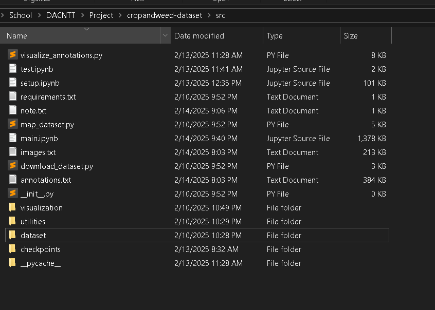
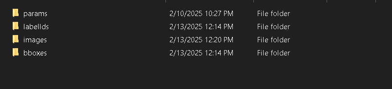
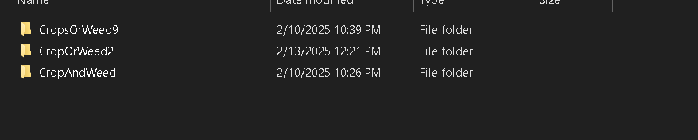
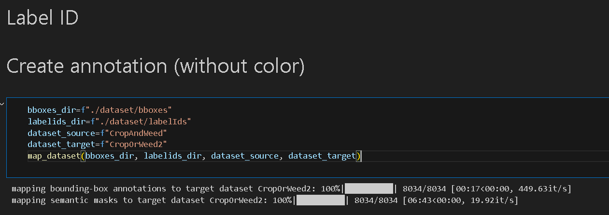
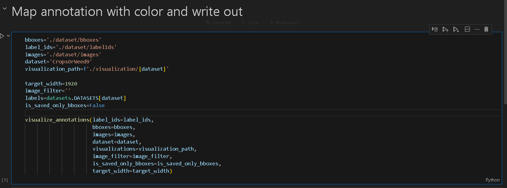
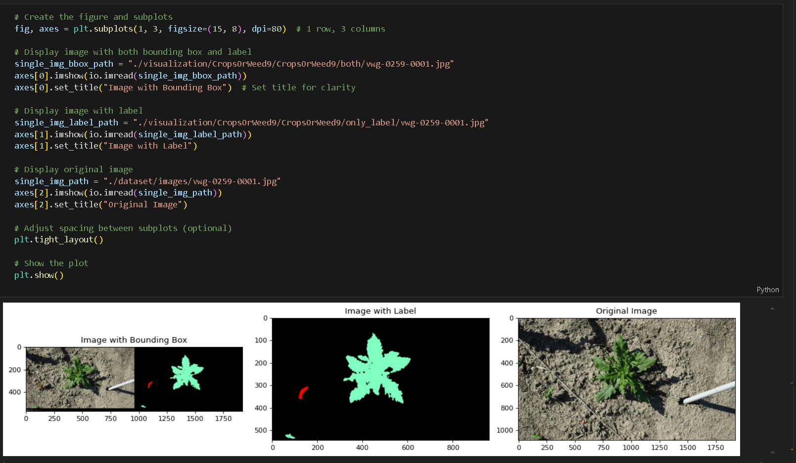

# Introduction
- This is a XAI project for our final class, we implemented XAI quantitative evaluation metrics like IOU, Precision, Recall,.. based on this paper [XAI Benchmark for Visual Explanation](https://arxiv.org/abs/2310.08537)
- We chose a new published Agriculture dataset named WeedAndCrop, you can check out for more detail here: [The CropAndWeed Dataset](https://github.com/cropandweed/cropandweed-dataset)

- A presentation slides of this this project is here if you want to read the summary: https://docs.google.com/presentation/d/1z4RzbtKOd7iWRAmoAusEV6Eexd1EXdcDUslYslfgVL4/edit?usp=sharing
## How to run this project
## Step 1: Download the dataset
- You can download a dataset for this in 2 ways: Directly download using HTTP links or through Python script in `download_dataset.py` file
- After download completed, please create a folder named `dataset` in `src/` directory s like the image below and extract all 4 rar files in there
  
- after extracted, your `dataset` folder will have 4 folders like below

- In `download_dataset.py` and `download_dataset.py`, you have folders containing variant annotation like: CropOrWeed2, CropsOrWeed9. 

##  Step 2: Use map_dataset.py to convert between annotation variants
- Go into `setup.ipynb`, it already includes all parameters you need to convert between annotations 

## Step 3: Use visualize_annotations.py to visualize bounding-box and semantic segmentation of crop images
- Like the step above, go into `setup.ipynb`, it already includes all parameters you need to visualize images

## Final step: use `main.ipynb` to train and predict using model for XAI explanation



# Reference
```BibTeX
@InProceedings{Steininger2023CropAndWeedDataset,
    author    = {Steininger, Daniel and Trondl, Andreas and Croonen, Gerardus and Simon, Julia and Widhalm, Verena},
    title     = {The CropAndWeed Dataset: a Multi-Modal Learning Approach for Efficient Crop and Weed Manipulation},
    booktitle = {Proceedings of the IEEE/CVF Winter Conference on Applications of Computer Vision (WACV)},
    month     = {January},
    year      = {2023},
    pages     = {tbd-tbd}
}
```